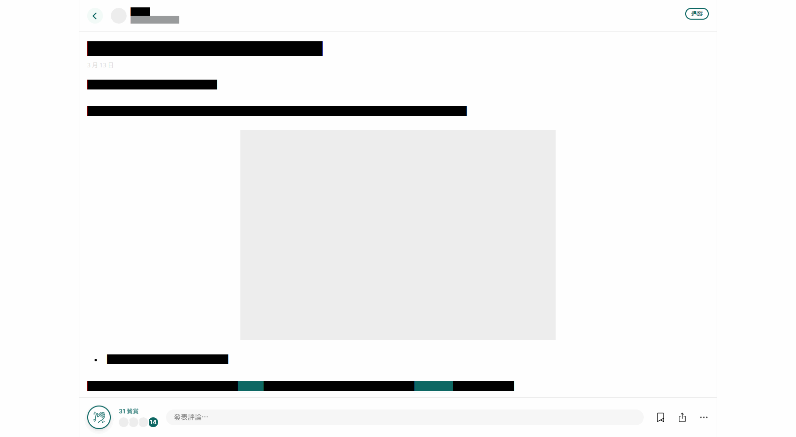

# Focus Matters

Focus Matters 是志在改善桌面端 [Matters](https://matters.news/) 的使用者樣式。

## 功能

- 擴大頁面至屏幕大小
- 隱藏內容頁的導航欄與側邊欄
- 改善圓角元素的空間平衡
- 改善元素過渡動畫

## 安裝

先安裝 [Stylus](https://github.com/openstyles/stylus)。

然後[按此安裝使用者樣式](https://raw.githubusercontent.com/Small-Ku/focus-matters/master/focus-matters.user.css)。

## 使用

在 Matters 的內容頁，把滑鼠置於左側空白位置喚出導航欄；
而置於右側喚出側邊欄。

如下圖所示：

## 規劃

- 增加使用者選項
- 爲 Matters 增加暗色模式

## 參與

歡迎在 [Issues](https://github.com/Samll_Ku/focus-matters/issues) 提出問題和建議，
也歡迎提出 Pull Requests。

本項目使用[語義化版本](https://semver.org/)。

## 授權

[MIT](https://opensource.org/licenses/MIT)
