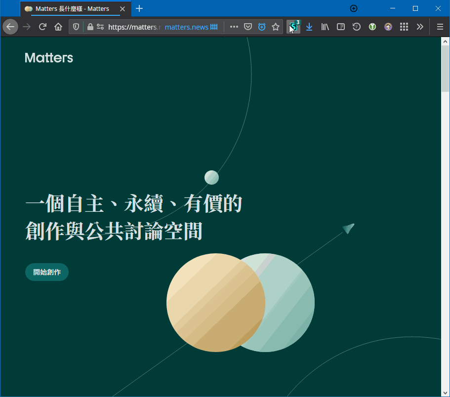

# Focus Matters

Focus Matters 是志在改善 [Matters](https://matters.news/) 的使用者樣式。

## 功能

- 擴大頁面內容大小
- 隱藏內容頁的導航欄與側邊欄
- 優化頁面元素視覺平衡與統一
- 加入暗色模式 (Dark Mode)

## 安裝

先安裝 [Stylus](https://github.com/openstyles/stylus)。

然後[按此安裝使用者樣式](https://raw.githubusercontent.com/Small-Ku/focus-matters/master/focus-matters.user.styl)。

## 使用

安裝後，如下圖所示點開 Stylus 的圖示，點擊 Focus Matters 的齒輪按鈕進入選項，

並按需開關或選擇：

- 擴大內容：
  - 專注內容
  - 仿製原本
  - 關閉
- 暗色模式
- 視覺優化

在專注內容模式下的內容頁，把滑鼠置於左側空白位置喚出導航欄；
而置於右側喚出側邊欄。

如下圖所示：

## 規劃

- 暗色模式跟隨系統的選項
- 純 CSS 版本 ([#1][i1])
- 在平板下擴大內容

## 參與

歡迎在 [Issues](https://github.com/Samll_Ku/focus-matters/issues) 提出問題和建議，
也歡迎提出 Pull Requests。

本項目使用[語義化版本](https://semver.org/)。

## 授權

[MIT](https://opensource.org/licenses/MIT)

[i1]: https://github.com/Samll_Ku/focus-matters/issues/1